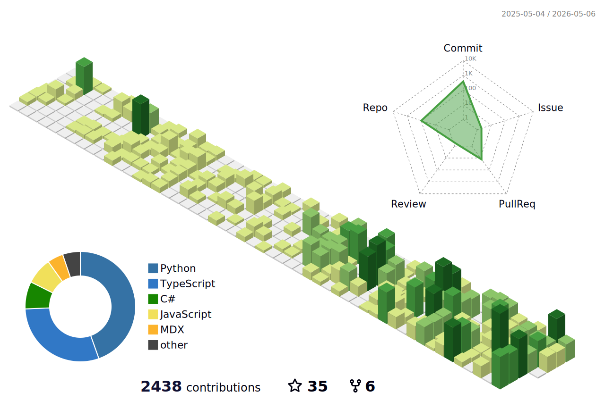
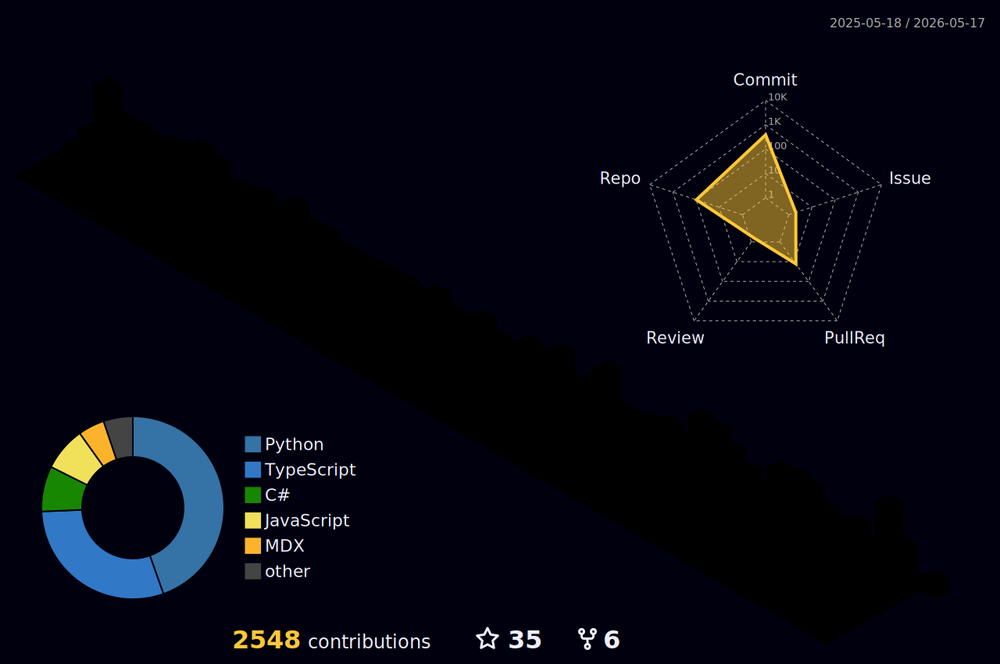

  

  <strong>human-machine symbiosis // supercoordination // physical AI // XR agents // computational cognition</strong>

  

  

  <a href="https://github.com/Caerii?tab=repositories"><strong>browse 190+ repos</strong></a> ·
  <a href="#repos-worth-opening"><strong>jump to the good ones</strong></a> ·
  <a href="#work-trace-topology"><strong>work trace</strong></a>

  

## hi

I'm Alif. I keep coming back to the same problem: most software treats people as operators sitting in front of a screen, but the interesting work happens in rooms, in bodies, between people, across time. I want to build the interfaces for *that*.

In practice I end up somewhere between XR, brain-computer interfaces, multi-agent systems, and modular robotics. I studied in the US and at DTU in Denmark, did MIT Reality Hack in 2023 and 2026, and now run [Superintelligent Group](https://www.superintelligent.group). Before that I worked through Halcyox. Some of these repos are polished. Most aren't. The messy ones are usually the most recent.

I also once prompted AI to generate [a dating website for worms](https://github.com/Caerii/slither.in) and [inspired someone to stageplay my AI-generated youtube dialogues at an off-broadway theater in Brooklyn](https://github.com/Caerii/AI_Dialogues_2022), so calibrate accordingly.

## breadth (fast scan)

If you’re trying to understand range quickly: this account is a mix of XR prototypes, research code, web tools, civic projects, and odd art experiments. The list below is curated, but the repo index is the real proof: [`github.com/Caerii?tab=repositories`](https://github.com/Caerii?tab=repositories).

## active threads

| project | what | status |
| --- | --- | --- |
| Superintelligent.Group | swarm multiplayer IDE | building |
| [MosaicDrone](https://github.com/Caerii/MosaicDrone) | modular self-assembling drone swarm | designing |
| Assemblies / NEMO | computational cognition (assembly calculus) | researching |
| [CommonQuant](https://github.com/Caerii/CommonQuant.com) | market agent societies | testing |
| Unionize.Software | worker coordination tools | organizing |

## repos worth opening

### current work

[**codrawer-bridge**](https://github.com/Caerii/codrawer-bridge) — reMarkable Paper Pro streams pen strokes to a desktop server; an AI worker sends back "ghost strokes" on a separate layer. You draw, the machine draws with you, and the round-trip is fast enough that it doesn't interrupt the line. This is the project I care about most right now.

[**AugmentivLabOS**](https://github.com/Caerii/AugmentivLabOS) — AI-XR co-scientist platform. A TypeScript codebase for an AI lab operating system that pairs with spatial computing.

[**TYPHON**](https://github.com/Caerii/TYPHON) — hierarchical cross-episodic associative memory. The kind of memory I want every agent I build to eventually have. Not a lookup table, but something that accumulates structure over time. Inspired by Deepmind's TITANS and MIRAS.

[**CollaborationCircuitsMechInterp**](https://github.com/Caerii/CollaborationCircuitsMechInterp) — mechanistic interpretability applied to multi-agent collaboration. Most interp work looks inside a single model. This looks at what happens between them. 25 commits of actual research.

[**feb_2_26_multi_agent_research**](https://github.com/Caerii/feb_2_26_multi_agent_research) — a research tranche on multi-agent systems. 34 commits of experiments and explorations.

### XR and spatial

[**OpenGalea**](https://github.com/Caerii/OpenGalea) — open-source mixed reality BCI. The question driving it: what if intent and attention were inputs to spatial computing the same way a mouse is an input to a desktop? Most starred repo on this account.

[**MicrocosmXR**](https://github.com/Caerii/MicrocosmXR) — multiplayer XR sandbox where players have god-like control over a virtual civilization. Underneath the toy framing: how do multiple people share and edit a world model in 3D?

[**LifeInBetweenXR**](https://github.com/Caerii/LifeInBetweenXR) — 3D map viewer built at MIT Reality Hack 2023. 36 commits, C#/Unity, the kind of intense hackathon sprint that actually produces a working thing.

[**SemanticTerrain**](https://github.com/Caerii/SemanticTerrain) — natural-language-driven terrain generation. You describe a landscape, it builds one.

[**3D-Web-Sandbox**](https://github.com/Caerii/3D-Web-Sandbox) — physics sandbox in the browser. One of my "I just want to see things move" projects.

[**WearableHolographicTheatreKid**](https://github.com/Caerii/WearableHolographicTheatreKid) — exactly what it sounds like. A wearable holographic theater piece, built with Sylas Horowitz.

### tools and platforms

[**VisuaML**](https://github.com/Caerii/VisuaML) — visual ML editor on the web. 56 commits. I wanted ML tooling that feels like a design tool, not a terminal. Live at [visuaml.com](https://visuaml.com/).

[**smartsight-backend**](https://github.com/Caerii/smartsight-backend) — backend for SmartSight, an accessibility/vision project. 55 commits of JavaScript.

[**Task-Matrix-Flow**](https://github.com/Caerii/Task-Matrix-Flow) — a task-flow matrix tool. TypeScript, 16 commits.

[**AI-ID**](https://github.com/Caerii/AI-ID) — personalized qualitative user context layer for AI apps. The idea: AI should know who it's talking to, not in a surveillance way, but in a "carry context" way.

[**SwarmIDE-Alpha**](https://github.com/Caerii/SwarmIDE-Alpha) — early prototype of a flow-state multi-agent project creation environment. Precursor to what became Superintelligent.Group.

[**unlinkedin.org**](https://github.com/Caerii/unlinkedin.org) — "work clicker." 14 commits of mild satire.

### research and science

[**fast360compression**](https://github.com/Caerii/fast360compression) — saliency-based compression for 360-degree video, from a Georgia State REU. 56 commits, C, 5 stars. Real research code.

[**Low-Light-Enhancement-GAN**](https://github.com/Caerii/Low-Light-Enhancement-GAN) — computational photography from DTU. GANs for low-light image enhancement.

[**CS473-ComputerVisionClass**](https://github.com/Caerii/CS473-ComputerVisionClass) — a full semester of computer vision work. 72 commits. Filters, feature detection, segmentation, the whole progression.

[**IS426_Audio2Spectrogram**](https://github.com/Caerii/IS426_Audio2Spectrogram) — audio-to-spectrogram processing pipeline for classification.

[**Kernel-Optimization-Puzzles**](https://github.com/Caerii/Kernel-Optimization-Puzzles) — GPU kernel optimization challenges.

[**WhyHowBeta**](https://github.com/Caerii/WhyHowBeta) — experimental implementation of WhyHow.AI graph toolkits for AI knowledge graph understanding. 13 commits.

### creative and early work

[**TheBabelBook**](https://github.com/Caerii/TheBabelBook) — the Library of Babel, but with GPT-3. 54 commits. One of my earlier projects and still one of my favorites.

[**GraphicsGame**](https://github.com/Caerii/GraphicsGame) — you are Tony Collins, the president of the school (my undergrad, Clarkson University in Potsdam, NY) and you need to absorb everyone and everything. JavaScript, CS452 graphics class final.

[**GPT3WebSummarizer**](https://github.com/Caerii/GPT3WebSummarizer) — early GPT-3 project: paste a URL, get a summary. C#/Unity, from 2021 when that was still a novel idea.

[**ClackPublic**](https://github.com/Caerii/ClackPublic) — client-server communication with a GUI. 10 commits of networking fundamentals.

[**criticaltheory-wiki**](https://github.com/Caerii/criticaltheory-wiki) — a wiki for applied critical theory. Live at [criticaltheory.wiki](https://criticaltheory.wiki/).

### civic

[**LaborRightsNYC**](https://github.com/Caerii/LaborRightsNYC) — reforming labor in NYC, backed by evidence and data. TypeScript.

[**Carbon-Fee-and-Dividend-Simulator**](https://github.com/Caerii/Carbon-Fee-and-Dividend-Simulator) — simulator for Massachusetts state-level carbon fee policy. Python.

## project constellation

## work-trace topology

[website](https://www.alifjakir.com/) · [email](mailto:alif@superintelligent.group) · [linkedin](https://www.linkedin.com/in/alif-jakir)
